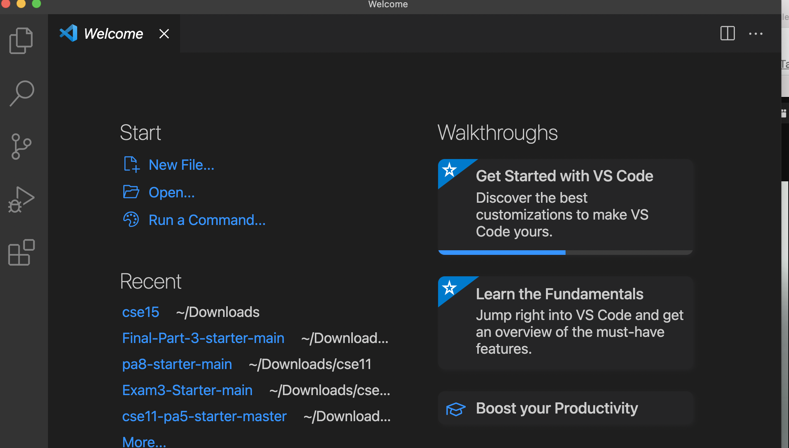
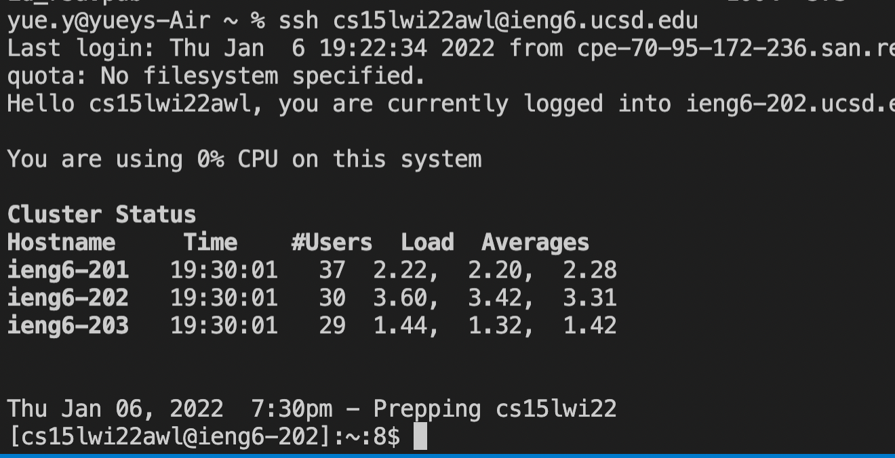
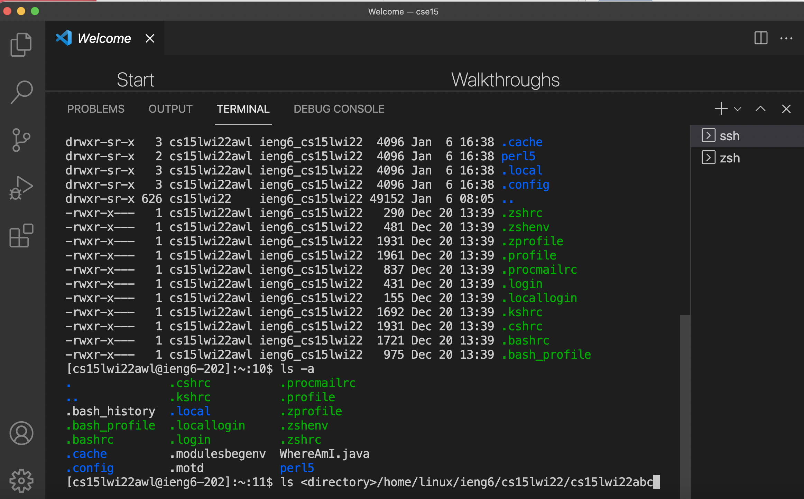
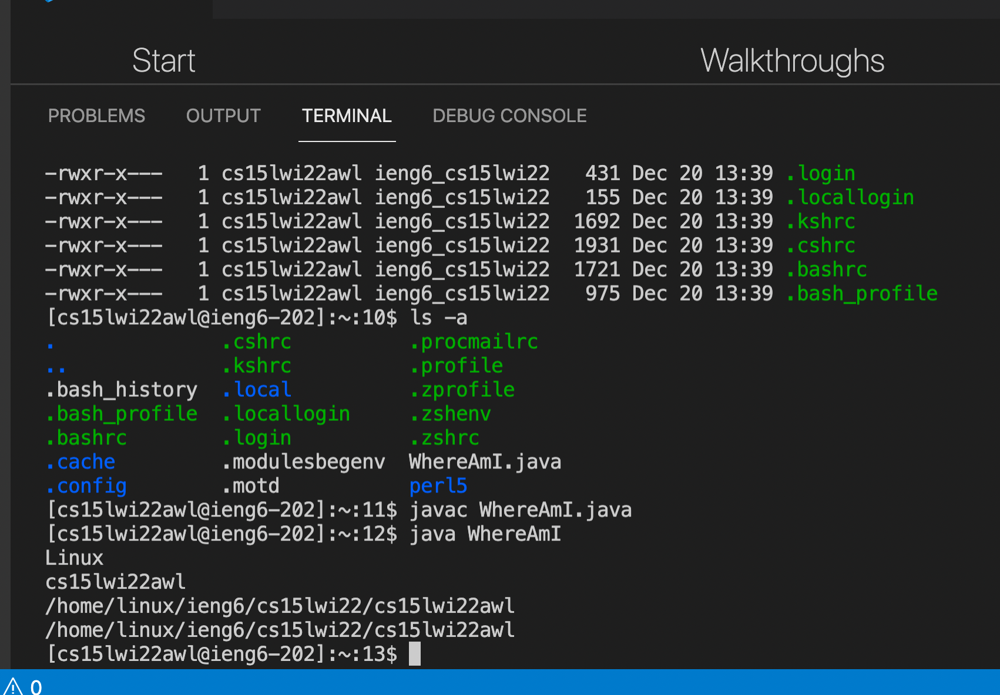
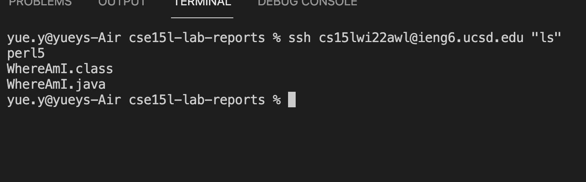

# Remote Access and the Filesystem 
## Overview
In this lab, you will use VScode to connect to CSE lab computers and edit files remotely. This tutorial consists of 6 steps.
1. Installing VScode
2. Remotely Connecting
3. Trying Some Commands
4. Moving Files with ```scp```
5. Setting an SSH Key
6. Optimizing Remote Running

---

## Tutorial 
### Step 1: Instaling VScode
>1.  Visit the [Visual Studio Code](https://code.visualstudio.com/) website 
>2.  follow the instruction and dowland the right version for your operating system

##### Once the VScode is installed, you should be open a window look like this 



---
### Step 2: Remotely Connecting
>1. look up course-specefic account on UCSD [Educaitonal Technology Servies](https://sdacs.ucsd.edu/~icc/index.php) webpege and change your password.
>2. Open a terminal and running the command ```ssh``` with your course-specific account 
>```
>$ ssh cs15lwi22zz@ieng6.ucsd.edu
>```
>
> 3.  After running the command, type yes and enter your passcode. 

##### The window should look like this after you logged in:



##### Ps: If you had trouble changing the password, you can follow the tutorial on [piazza](https://piazza.com/class/kxs0toocqhv4og?cid=54).

---
### Step 3: Trying some Commands
> 1. Try some commands listed in the below
>   ```
>   $ cd ~
>   $ cd
>   $ ls -lat
>   $ ls -a
>   $ ls <directory>
>   $ cp /home/linux/ieng6/cs15lwi22/public/hello.txt ~/```
>   $ cat /home/linux/ieng6/cs15lwi22/public/hello.txt
>```
> 2. To log out the remote server, press Ctrl-D

##### The window should look similar to this after you run some commmands:



- - -
### Step 4: Moving Files with ```scp```
> 1. From the client, run the ```scp``` command with the file you want to move, using your username
>```
> $ scp WhereAmI.java cs15lwi22zz@ieng6.ucsd.edu:~/```
>```
> 2. Enter your password
> 3. Log into the server and use ```ls```
> 4. Compile and run the file on the ieng6 computer

##### The window should look like this after you run the file on the server:



- - -
### Step 5: Setting an SSH Key
> 1. On client, run the command ```ssh-keygen```
> 2. Enter empty for no passphrase
> 3. Log into the server and run the command ```mkdir .ssh```
> 4. Press Ctrl+D to log out
> 5. Move your public key file to the ieng6 computer. The command should look similar to this:
> ```
> $ scp /Users/yue.y/.ssh/id_rsa.pub cs15lwi22awl@ieng6.ucsd.edu:~/.ssh/authorized_keys
>```

##### Once you succesfully set up the SSH Key, you are able to log into the sever without password!


- - - 
### Step 6: Optimzing Remote Running
> 1. To run remote code more easily, you can run the command in quotes after the ```ssh``` command 
>```
> $ ssh cs15lwi22awl@ieng6.ucsd.edu "ls"
> ```
> 2. you can run mutiple commands on the same line using semicolons
>```
> $ cp WhereAmI.java OtherMain.java; javac OtherMain.java; java WhereAmI
>```

##### The window should look like this after you run  the ```ls``` command after ```ssh```



- - - 
## Congratulaiton! You finish the tutorial !


