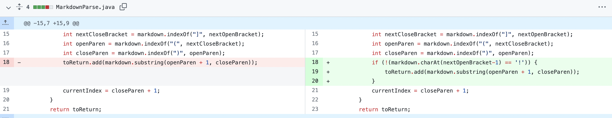

# Incremental Programming and Debugging
----
### Code Change 1

This [file](https://yu3-y.github.io/markdown-parse/test-file6.html) was an failure-induced input.

The symptom:

#### The code was unable to distingush between image and the link. So when the test was done on file 6, the link to the image was print out.
---
### Code Change 2

This [file](https://yu3-y.github.io/markdown-parse/test-file3.html) was an failure-induced input.

The symptom:

#### The test was not able to run on file that does not contains parenthesis. So when the test was run on file 3, it will give us an index out of bound error.

---
### Code Change 3

This [file](https://yu3-y.github.io/markdown-parse/test-file5.html) was an failure-induced input.

The symptom:

#### The output reutrn an link of a page, however the link is not linked to the object inside the [].