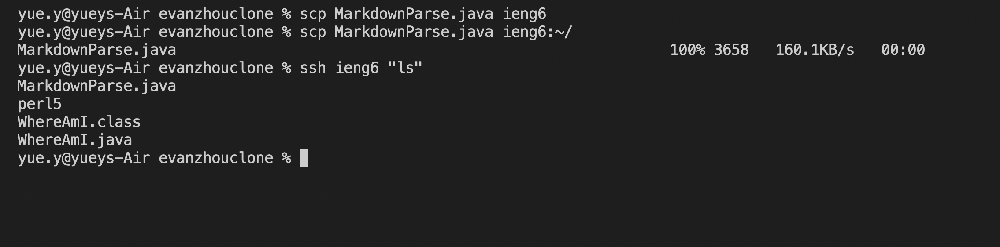

# Streamline ```ssh``` Configuration
- - - 
### set up and editing ```.ssh/config``` file

The eidting was done on VS code
- - - 
### using ```ssh`` command to login

- - - 
### using ```scp``` command to copy file
