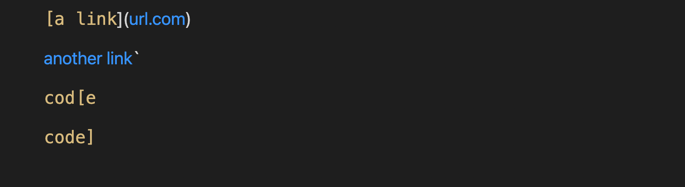
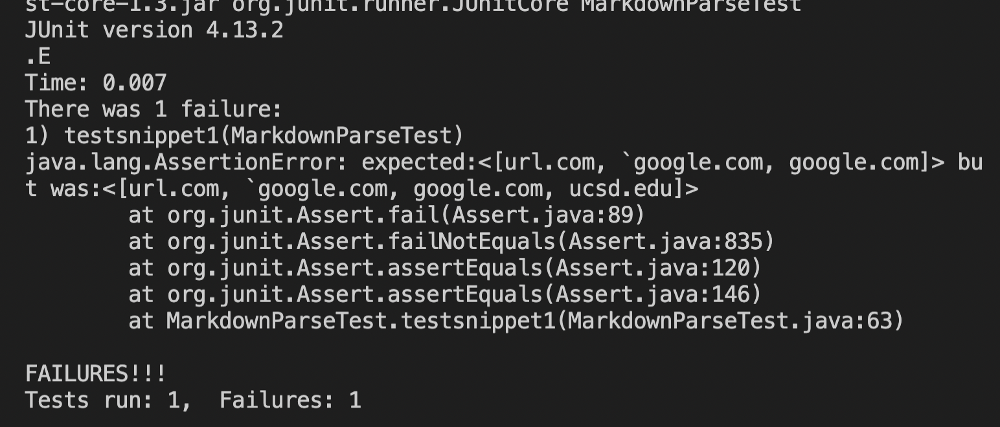
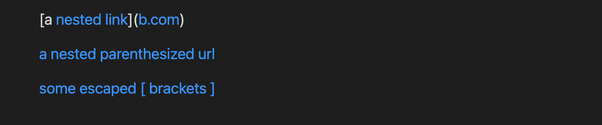
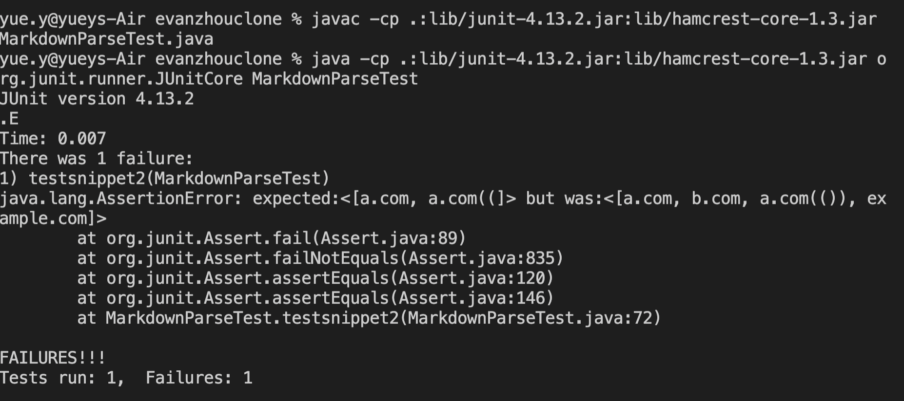
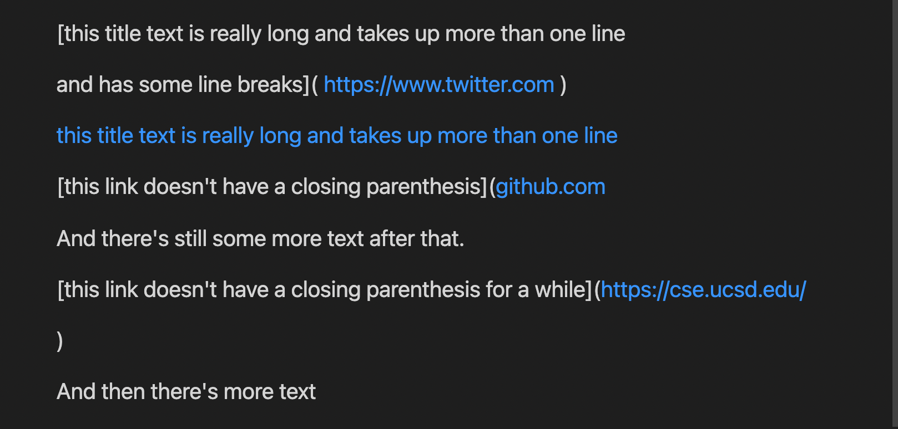
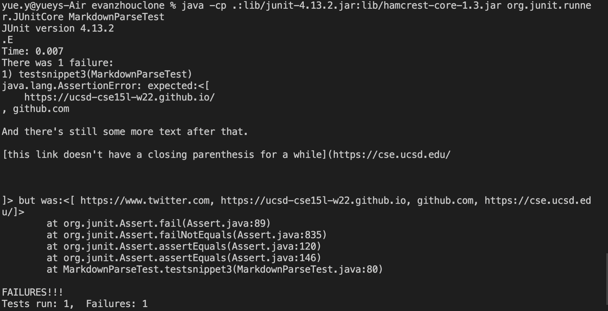

# Markdown File Review
- - -
> Overview: Two Markdown files were under review. 3 implementations were made to each file to discover issues.

Repo links to the Markdownfiles:

[Markdown File 1](https://github.com/ezhou413/markdown-parse)

[Markdown File 2](https://github.com/sm52/markdown-parse)

- - - 
### Snippet 1
This implementaion should produce the following result


the test was written in the MarkdownTest file
```
 @Test
    public void testsnippet1() throws IOException {
        String contents = Files.readString(Path.of("snippet1.md"));
        List<String> expect = List.of("url.com","`google.com","google.com","ucsd.edu");
        assertEquals(MarkdownParse.getLinks(contents), expect);
    }

```
output after running the test
#### Markdown File 1


- - -
### Snippet 2
This implementaion should produce the following result


the test was written in the MarkdownTest file
```
@Test
    public void testsnippet2() throws IOException {
        String contents = Files.readString(Path.of("snippet2.md"));
        List<String> expect = List.of("a.com","b.com","a.com(())","example.com");
        assertEquals(MarkdownParse.getLinks(contents), expect);
    }

```
output after running the test
#### Markdown File 1

- - - 
### Snippet 3
This implementaion should produce the following result


the test was written in the MarkdownTest file
```
 @Test
    public void testsnippet3() throws IOException {
        String contents = Files.readString(Path.of("snippet3.md"));
        List<String> expect = List.of(" https://www.twitter.com","https://ucsd-cse15l-w22.github.io","github.com","https://cse.ucsd.edu/");
        assertEquals(MarkdownParse.getLinks(contents), expect);
    }

```
output after running the test
#### Markdown File 1

